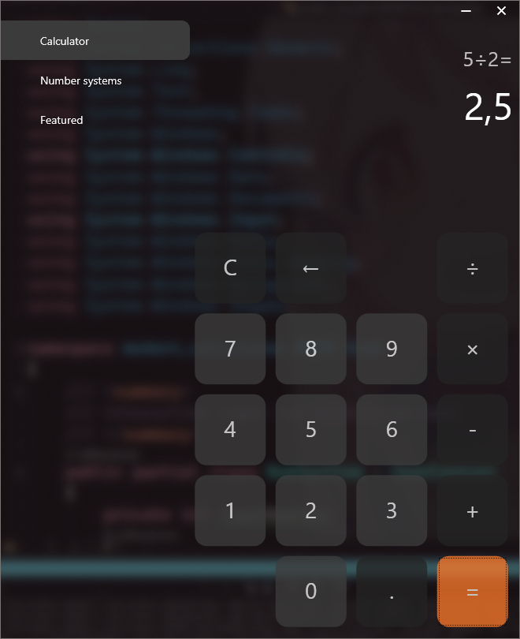
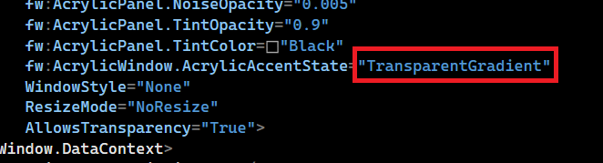
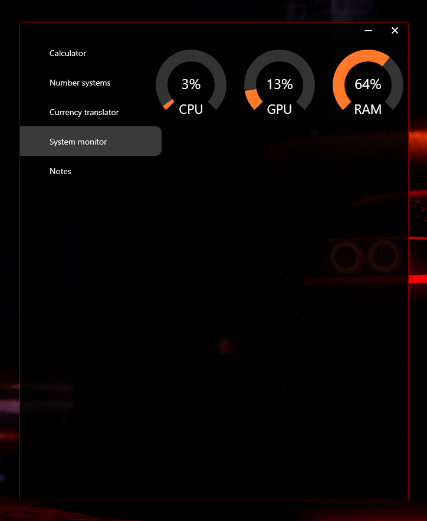

# modern_calculator
I want to make a beautiful and convenient calculator with many functions.

It looks pretty well (win10)

For some reason, AcrylicWindow does not work correctly on Windows 11. If you want to check or are using Windows 10 (I don't know if it works on other versions), then **change the parameter in the following figure in MainWindow.xaml to _BlurBehind_.**

It looks good enough (win11)
